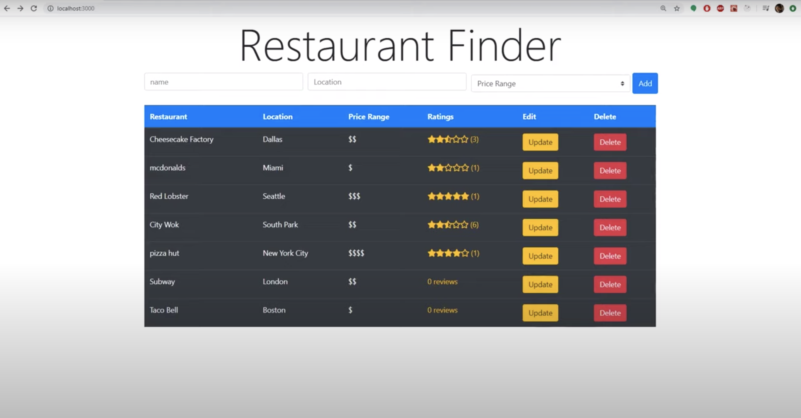

# yelp_clone
This a yelp clone the utalizes Postgres and Express to add, store, and update restaurants as wells as their ratings.

## Description
A Yelp clone with Postgres, Express, React, and Node.js

## Motivation
This is an opportunity to practice my work with the backend of development by learning the PERN stack by building a Yelp clone. It allows customers to input restraunts they have been to and add a star rating for that restaurant. 

## Challenges and Solutions
## Build status
Build status of continuous integration i.e. travis, appveyor etc. Ex. - 
[](https://travis-ci.org/akashnimare/foco)
[](https://ci.appveyor.com/project/akashnimare/foco/branch/master)

## Code style
If you're using any code style like xo, standard etc. That will help others while contributing to your project. Ex. -
[](https://github.com/feross/standard)

## Screenshots


## Tech/framework used
Ex. -
<b>Built with</b>
- [Electron](https://electron.atom.io)

## Features
What makes your project stand out?

## Code Example
Show what the library does as concisely as possible, developers should be able to figure out **how** your project solves their problem by looking at the code example. Make sure the ```API``` you are showing off is obvious, and that your code is short and concise. To indicate code, use three back ticks before and after code.  It will look like this: ```index.html```

## Installation
npm init
npm install express
npm intall -g nodemon

## API Reference
Depending on the size of the project, if it is small and simple enough the reference docs can be added to the ```README```. For medium size to larger projects it is important to at least provide a link to where the ```API``` reference docs live.

## Tests
Describe and show how to run the tests with code examples.

## How to use?
If people like your project they'll want to learn how they can use it. To do so include step by step guide to use your project.

## Credits
Course developed by Sanjeev Thiyagarajan
Source code: https://www.youtube.com/redirect?event=video_description&redir_token=QUFFLUhqbVA0VFF6ZVVZZFpYdDY1LUFBM3JOSlVES2txZ3xBQ3Jtc0ttYU9BSjkyOVRFdWhKR1FjcjBnLU9RVjVZZjVsUkN3dzkzRmxoRkhjeFFOdTVja2NnMWhoRmpUc0kwNXEtS0JrSDFlcHZ3dnhVN0VOOUNHR0FiVDVVbFpvano4MWxiczhQTF9yalVIZ0l0TWcyQU5JVQ&q=https%3A%2F%2Fgithub.com%2FSanjeev-Thiyagarajan%2FPERN-STACK-YELP-CLONE

#### Anything else that seems useful
## License
A short snippet describing the license (MIT, Apache etc)
MIT © [Athena]()
